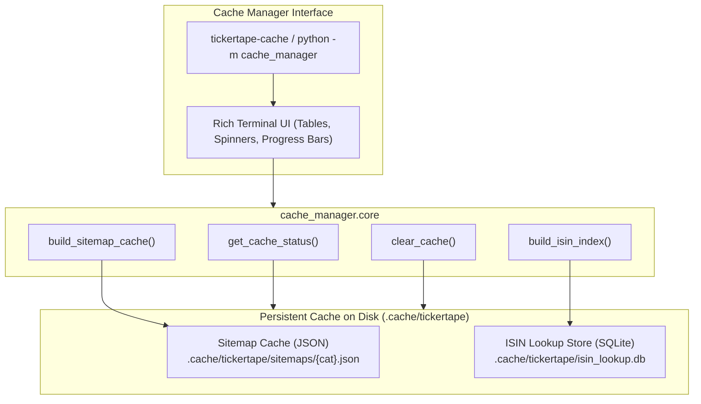

# Cache Manager CLI & Service

`cache_manager` (CLI command: `tickertape-cache`) is an operational tool and programmatic service built on top of `tickertape-client`. It provides terminal controls, visual dashboards, and background task runners for managing local persistent caches.

---

## Overview

The client maintains a two-tier persistent caching architecture to optimize performance and respect rate limits:



1. **Tier 1: Sitemaps Cache (JSON)**
   Parsed sitemap URLs stored in `.cache/tickertape/sitemaps/{category}.json`. Sitemaps change slowly (typically once per day) and range from 500 KB to 5 MB per category.
2. **Tier 2: ISIN Lookup Database (SQLite)**
   A relational lookup database in `.cache/tickertape/isin_lookup.db` that maps mutual fund ISINs (e.g., `INF966L01721`) to TickerTape slugs, NAVs, AMCs, plans, options, and categories.

---

## Installation & Invocation

The Cache Manager is bundled with `tickertape-client`.

### Option A: Installed Console Script

```bash
tickertape-cache --help
```

### Option B: Python Module Execution

```bash
python -m cache_manager --help
```

### Option C: Using `uv`

```bash
uv run tickertape-cache status
```

---

## Global Options

All subcommands accept the global `--cache-dir` flag, which can be placed either before or after the subcommand:

```bash
tickertape-cache --cache-dir /custom/path/cache status
tickertape-cache status --cache-dir /custom/path/cache
```

| Flag           | Default             | Description                                                 |
| :------------- | :------------------ | :---------------------------------------------------------- |
| `--cache-dir`  | `.cache/tickertape` | Absolute or relative path to the persistent cache directory |
| `-h`, `--help` |                     | Show help messages and available commands                   |

---

## Command Reference

### 1. `status`

Inspects the cache directory and prints formatted tables with item counts, file sizes, and timestamps.

```bash
tickertape-cache status
```

#### Terminal Output Example:

```text
╭──────────────────────────────────────────────╮
│ Cache Directory: .cache/tickertape           │
╰────────────── TickerTape Cache Manager ──────╯

                       Sitemaps Cache (JSON)
┏━━━━━━━━━━━┳━━━━━━━━━┳━━━━━━━━━┳━━━━━━━━━━━┳━━━━━━━━━━━━━━━━━━━━━┓
┃ Category  ┃ Status  ┃ Records ┃ File Size ┃ Last Fetched (UTC)  ┃
┣━━━━━━━━━━━╋━━━━━━━━━╋━━━━━━━━━╋━━━━━━━━━━━╋━━━━━━━━━━━━━━━━━━━━━┫
┃ stocks    ┃ Missing ┃       - ┃         - ┃ Never               ┃
┣━━━━━━━━━━━╋━━━━━━━━━╋━━━━━━━━━╋━━━━━━━━━━━╋━━━━━━━━━━━━━━━━━━━━━┫
┃ etf       ┃ Missing ┃       - ┃         - ┃ Never               ┃
┣━━━━━━━━━━━╋━━━━━━━━━╋━━━━━━━━━╋━━━━━━━━━━━╋━━━━━━━━━━━━━━━━━━━━━┫
┃ mf        ┃ Cached  ┃   4,821 ┃  420.5 KB ┃ 2026-09-25 18:30:10 ┃
┣━━━━━━━━━━━╋━━━━━━━━━╋━━━━━━━━━╋━━━━━━━━━━━╋━━━━━━━━━━━━━━━━━━━━━┫
┃ us-stocks ┃ Missing ┃       - ┃         - ┃ Never               ┃
┣━━━━━━━━━━━╋━━━━━━━━━╋━━━━━━━━━╋━━━━━━━━━━━╋━━━━━━━━━━━━━━━━━━━━━┫
┃ us-etf    ┃ Missing ┃       - ┃         - ┃ Never               ┃
┗━━━━━━━━━━━┻━━━━━━━━━┻━━━━━━━━━┻━━━━━━━━━━━┻━━━━━━━━━━━━━━━━━━━━━┛

                    ISIN Lookup Engine (SQLite)
┏━━━━━━━━━━━━━━━━━┳━━━━━━━━━━━━━━━━━━━━━━━━━━━━━━━━━━━━━━━━━━━━━━━┓
┃ Property        ┃ Value                                         ┃
┣━━━━━━━━━━━━━━━━━╋━━━━━━━━━━━━━━━━━━━━━━━━━━━━━━━━━━━━━━━━━━━━━━━┫
┃ Database Status ┃ Ready                                         ┃
┃ Indexed Funds   ┃ 4,821 records                                 ┃
┃ File Size       ┃ 1248.0 KB                                     ┃
┃ File Path       ┃ .cache/tickertape/isin_lookup.db              ┃
┗━━━━━━━━━━━━━━━━━┻━━━━━━━━━━━━━━━━━━━━━━━━━━━━━━━━━━━━━━━━━━━━━━━┛
```

---

### 2. `build`

Fetches live data from TickerTape and builds/refreshes local caches.

#### Syntax

```bash
tickertape-cache build <target> [options]
```

#### Targets

- `sitemap`: Download, parse XML, and persist JSON cache.
- `index`: Crawl mutual fund pages and populate the SQLite ISIN lookup table.

#### Options for `build sitemap`

```bash
tickertape-cache build sitemap --category mf
tickertape-cache build sitemap --category stocks --force
```

| Argument / Flag | Default | Description                                                        |
| :-------------- | :------ | :----------------------------------------------------------------- |
| `--category`    | `mf`    | Category to download: `mf`, `stocks`, `etf`, `us-stocks`, `us-etf` |
| `--force`       | `False` | Force live HTTP download even if non-empty cache already exists    |

#### Options for `build index`

```bash
tickertape-cache build index --concurrency 5 --delay 0.5 --limit 100
```

| Argument / Flag | Default | Description                                                                   |
| :-------------- | :------ | :---------------------------------------------------------------------------- |
| `--concurrency` | `5`     | Number of concurrent asynchronous HTTP workers                                |
| `--delay`       | `0.5`   | Politeness delay in seconds between consecutive requests per worker           |
| `--limit`       | `None`  | Optional maximum number of funds to process (ideal for testing or batch runs) |
| `--force`       | `False` | Forces re-download of the sitemap and re-crawls all items                     |

> [!NOTE]
> When `--force` is omitted, the crawler runs in **resumable mode**: it checks the existing SQLite records and only crawls mutual funds that are not yet indexed.

#### Progress Bar Visuals

During indexing, a live Rich progress bar tracks completion, item counts, ETA, and real-time pass/fail metrics:

```text
╭─────────────────────────────────────────────────────────────╮
│ Target: Mutual Funds ISIN Database                          │
│ Concurrency: 5 workers | Delay: 0.5s | Limit: 50            │
╰──────────────────── Building ISIN Index ────────────────────╯

⠹ Indexing: 24/50 (✔ 23 ✖ 1) ━━━━━━━━━╺━━━━━━━━━━━━━ 48.0% 24/50 0:00:06
```

---

### 3. `clear`

Purges cached files from disk.

#### Syntax

```bash
tickertape-cache clear [options]
```

| Argument / Flag | Default | Description                                                                      |
| :-------------- | :------ | :------------------------------------------------------------------------------- |
| `--target`      | `all`   | What to delete: `all`, `sitemap`, or `isin`                                      |
| `--category`    | `None`  | If target is `sitemap`, optionally specify a single category (e.g. `mf`)         |
| `-y`, `--yes`   | `False` | Skip interactive safety confirmation prompt (required for headless / CI scripts) |

#### Interactive Confirmation Prompt

Running `clear` without `-y` will ask for confirmation before deleting data:

```bash
tickertape-cache clear --target all
# ? Are you sure you want to purge all 'all' cache? [y/N]: y
# ✔ Successfully purged all cache.
```

To run non-interactively (e.g., in a CI pipeline or Docker build):

```bash
tickertape-cache clear --target sitemap --category mf -y
```

---

## Programmatic API (`cache_manager.core`)

You can import and use `cache_manager.core` in your own Python scripts, web services, or automation jobs without using the terminal interface.

```python
import asyncio
from cache_manager import core

async def main():
    # 1. Inspect status programmatically
    status = core.get_cache_status()
    print("Cached sitemaps:", status["sitemaps"])
    print("Database records:", status["isin_db"]["records"])

    # 2. Build or refresh sitemaps
    mf_count = await core.build_sitemap_cache(category="mf", force=True)
    print(f"Cached {mf_count} mutual fund sitemap URLs.")

    # 3. Index mutual funds into SQLite with custom callback
    def progress_tracker(completed, total, ok, fail):
        print(f"[{completed}/{total}] Indexed: {ok} | Failed: {fail}")

    indexed = await core.build_isin_index(
        concurrency=4,
        delay=0.3,
        limit=50,
        progress_callback=progress_tracker,
    )
    print(f"Successfully indexed {indexed} funds.")

    # 4. Clear cache
    core.clear_cache(target="sitemap", category="mf")

if __name__ == "__main__":
    asyncio.run(main())
```

---

## Automation & Best Practices

### Scheduled Cache Warming (Cron / GitHub Actions)

To keep the local cache fresh for backend APIs or AI agents, run a scheduled job once daily:

```bash
# Crontab entry: Update mutual fund sitemap and refresh index daily at 02:00 AM
0 2 * * * cd /app && uv run tickertape-cache build sitemap --category mf --force && uv run tickertape-cache build index --concurrency 3 --delay 0.5
```

### Rate Limiting and Politeness

TickerTape pages are protected against excessive automated requests.

- Always use the default `--delay 0.5` or higher.
- Keep `--concurrency` between `3` and `6` to prevent HTTP 429 (Too Many Requests) or Cloudflare rate-limiting.
- If running a full index of all ~4,800 funds, allow 15–30 minutes for completion.

### Recovery from Corrupted Cache

If an unexpected system restart causes a corrupted JSON file:

1. `tickertape-cache status` will flag the category with status `Corrupted`.
2. Clear the corrupted file:
    ```bash
    tickertape-cache clear --target sitemap --category mf -y
    ```
3. Re-download:
    ```bash
    tickertape-cache build sitemap --category mf --force
    ```
