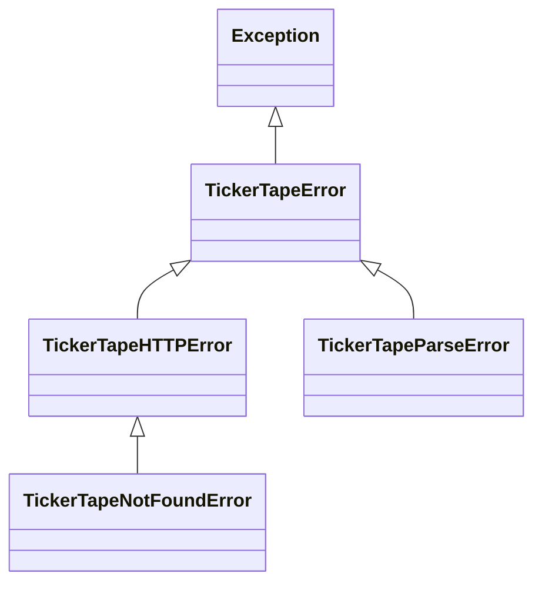

# Client Configuration & Error Handling

Learn how to configure `TickerTapeClient` settings, manage custom HTTP transports, and handle exceptions.

---

## Client Options

`TickerTapeClient` accepts several optional parameters upon initialization:

```python
from pathlib import Path
import httpx
from tickertape import TickerTapeClient

client = TickerTapeClient(
    base_url="https://www.tickertape.in",     # Base TickerTape URL
    timeout=30.0,                             # HTTP timeout in seconds
    cache_dir=Path(".cache/tickertape"),       # Local persistent cache path
    headers={"User-Agent": "MyCustomBot/1.0"},# Additional HTTP request headers
    sitemap_urls={...},                       # Override or add custom sitemaps
)
```

### Parameter Reference

| Parameter | Type | Default | Description |
| :--- | :--- | :--- | :--- |
| `base_url` | `str` | `"https://www.tickertape.in"` | Root endpoint for all relative paths. |
| `timeout` | `float` | `30.0` | Default timeout for network calls. |
| `cache_dir` | `Path \| str` | `".cache/tickertape"` | Directory storing sitemap JSON caches and SQLite lookup database. |
| `http_client` | `Optional[httpx.AsyncClient]` | `None` | Custom `httpx.AsyncClient` instance. If omitted, the client creates and manages its own. |
| `headers` | `Optional[dict[str, str]]` | `None` | Custom headers merged with default browser headers. |
| `sitemap_urls` | `Optional[dict[str, str]]` | `SITEMAP_URLS` | Mapping of category keys to sitemap URLs. |

---

## Custom HTTP Transport & Connection Pooling

If your application already manages an `httpx.AsyncClient` (for instance, in FastAPI or another async service), you can pass it directly:

```python
import httpx
from tickertape import TickerTapeClient

shared_http_client = httpx.AsyncClient(
    limits=httpx.Limits(max_connections=50, max_keepalive_connections=20),
    timeout=15.0,
)

client = TickerTapeClient(http_client=shared_http_client)
```

> [!NOTE]
> When providing an external `http_client`, calling `await client.close()` or using the context manager will **not** close your shared client.

---

## Low-Level Requests

`TickerTapeClient` exposes a direct `request()` method for custom endpoints:

```python
async with TickerTapeClient() as client:
    response_text = await client.request(
        method="GET",
        url_or_path="/mutualfunds/quant-active-fund-M_ESAF",
        params={"tab": "overview"},
    )
```

---

## Exception Hierarchy

All exceptions in `tickertape-client` inherit from `TickerTapeError`:



### Exception Details

- **`TickerTapeError`**: Base class for any client exception.
- **`TickerTapeHTTPError`**: Raised on network failures or unexpected 4xx/5xx HTTP status codes. Contains `.status_code` and `.response_data`.
- **`TickerTapeNotFoundError`**: Subclass of `TickerTapeHTTPError` specifically raised on HTTP 404.
- **`TickerTapeParseError`**: Raised when parsing XML sitemaps, HTML tags, or Next.js `__NEXT_DATA__` JSON fails.

### Handling Errors Gracefully

```python
from tickertape import (
    TickerTapeClient,
    TickerTapeError,
    TickerTapeHTTPError,
    TickerTapeNotFoundError,
    TickerTapeParseError,
)

async with TickerTapeClient() as client:
    try:
        fund = await client.mf.get("invalid-fund-name")
    except TickerTapeNotFoundError as exc:
        print(f"Fund not found (404): {exc}")
    except TickerTapeHTTPError as exc:
        print(f"HTTP communication error ({exc.status_code}): {exc}")
    except TickerTapeParseError as exc:
        print(f"Could not parse TickerTape page content: {exc}")
    except TickerTapeError as exc:
        print(f"Generic TickerTape error: {exc}")
```
