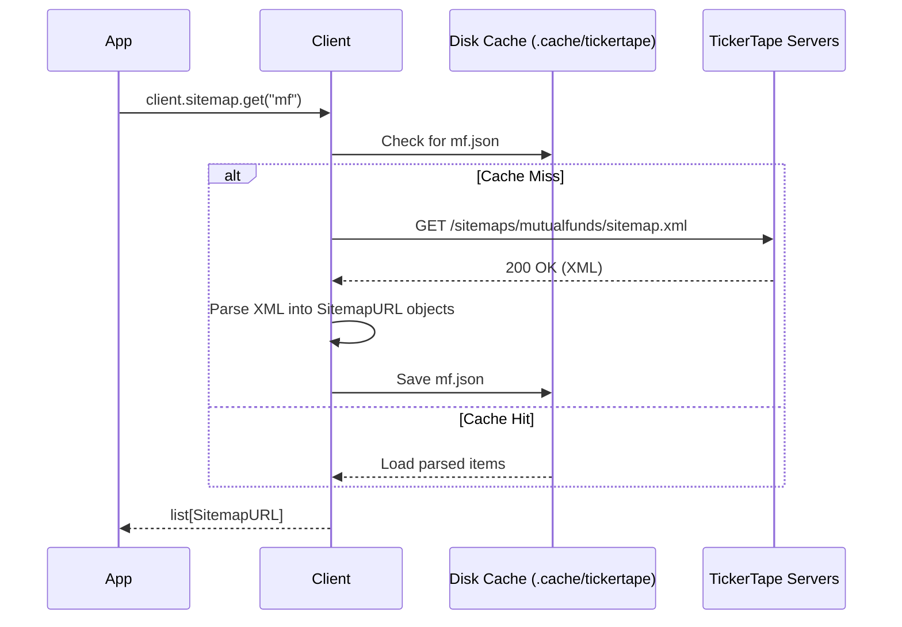

# Sitemaps & Persistent Caching

TickerTape serves large XML sitemaps that list thousands of available assets and pages. `tickertape-client` provides dedicated tooling to fetch, parse, and locally cache these sitemaps.

---

## Supported Categories

The client comes with predefined URLs for major asset categories:

| Category Key | Asset Type | Sitemap URL |
| :--- | :--- | :--- |
| `"mf"` | Indian Mutual Funds | `https://www.tickertape.in/sitemaps/mutualfunds/sitemap.xml` |
| `"stocks"` | Indian Stocks | `https://www.tickertape.in/sitemaps/stocks/sitemap.xml` |
| `"etf"` | Indian ETFs | `https://www.tickertape.in/sitemaps/etfs/sitemap.xml` |
| `"us-stocks"` | US Stocks | `https://www.tickertape.in/sitemaps/us-stocks/sitemap.xml` |
| `"us-etf"` | US ETFs | `https://www.tickertape.in/sitemaps/us-etfs/sitemap.xml` |

---

## Caching Architecture

Sitemaps are typically several megabytes in size and change slowly (usually once daily). Rather than re-downloading XML on every run:

1. **First Request:** `await client.sitemap.get("mf")` fetches the live XML, parses the elements, and saves them to `.cache/tickertape/sitemaps/mf.json`.
2. **Subsequent Calls:** Loaded instantly from disk without performing network I/O.
3. **Atomic Writes:** Disk writes use `.tmp` files and atomic replacement to prevent corrupted caches if interrupted.



---

## Usage Examples

### Loading or Refreshing Sitemaps

```python
async with TickerTapeClient() as client:
    # 1. Check if cache exists
    if client.sitemap.is_cached("mf"):
        print("Sitemap is already cached on disk.")

    # 2. Get items (uses cache if available)
    items = await client.sitemap.get("mf")
    print(f"Loaded {len(items)} sitemap items.")

    # 3. Force live download and update cache
    refreshed_items = await client.sitemap.refresh("mf")
    print(f"Refreshed {len(refreshed_items)} items from live XML.")
```

### Inspecting `SitemapURL` Attributes

Every parsed `<url>` entry produces a `SitemapURL` model:

```python
for item in items[:3]:
    print(f"Record ID:        {item.record_id}")
    print(f"URL:              {item.url}")
    print(f"Last Modified:    {item.last_modified}")
    print(f"Change Frequency: {item.change_frequency}")
    print(f"Priority:         {item.priority}")
```

### Parsing Sitemap Indexes (`<sitemapindex>`)

If a URL points to a master sitemap index referencing child XML files:

```python
async with TickerTapeClient() as client:
    references = await client.sitemap.get_references("https://example.com/sitemap_index.xml")
    for ref in references:
        print(f"Child sitemap: {ref.url} (modified: {ref.last_modified})")
```

### Clearing Caches

```python
# Clear cache for a specific category
client.sitemap.clear_cache("mf")

# Clear all sitemap caches in .cache/tickertape/sitemaps
client.sitemap.clear_cache()
```
