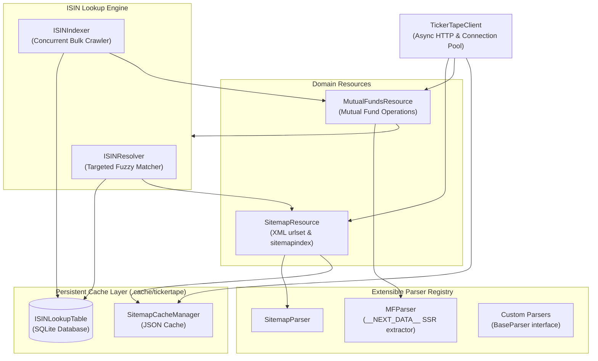

# TickerTape Client (Unofficial SDK)

[](https://pypi.org/project/tickertape-client/)
[](https://pypi.org/project/tickertape-client/)
[](https://github.com/sid-146/tickertape-client/actions/workflows/ci.yml)
[](https://opensource.org/licenses/Apache-2.0)
[](https://sid-146.github.io/tickertape-client/)

An **unofficial**, asynchronous, typed Python SDK and client for **[TickerTape](https://www.tickertape.in)** featuring persistent caching, Next.js hydration payload extraction, and an SQLite-backed ISIN lookup engine.

> [!NOTE]
> **Disclaimer:** `tickertape-client` is an **unofficial** community-maintained SDK/client and is not affiliated with, endorsed by, sponsored by, or associated with TickerTape or its parent companies. All product names, logos, and brands are property of their respective owners.

---

## Architecture Overview



---

## Key Capabilities

### ⚡ Async & High Performance

Built natively on `httpx` and `asyncio` for non-blocking HTTP requests, connection pooling, and concurrent crawling with fine-grained rate limiting.

### 🗺️ Sitemap Discovery & Persistent Caching

Automatically fetches and parses both standard sitemaps (`<urlset>`) and sitemap indexes (`<sitemapindex>`), atomically persisting parsed URLs to disk as JSON for instant subsequent loads.

### 📊 Next.js Hydration Scraping

Parses server-side rendered (SSR) Next.js payloads (`<script id="__NEXT_DATA__">`) into strongly typed Pydantic v2 models, unlocking:

- Latest NAV & 1-day percentage change
- Expense ratios, total AUM, and portfolio manager details
- Multi-dimensional scorecard ratings (Performance, Risk, Cost, Composition, Red Flags)
- Full benchmark indices and regulatory CAMS/RTA codes

### 🔍 SQLite ISIN Engine & Peer Discovery

Maps Indian mutual fund ISINs (e.g. `INF966L01721`) to TickerTape slugs and taxonomy:

- **Targeted Fuzzy Resolver:** Locates and verifies unindexed funds on demand using scheme name hints.
- **Peer Clustering:** Query peer mutual funds by sector, subsector, plan (`Direct`/`Regular`), and option (`Growth`/`IDCW`).
- **Resumable Bulk Indexing:** Asynchronously index thousands of schemes with progress tracking callbacks and export the results to JSON or CSV.

### 🔌 Extensible Design

Easily register custom parsers for new asset types or endpoints using the [`BaseParser`](reference/parsers.md) abstract interface and [`register_parser`](reference/parsers.md#tickertape.parsers.register_parser).

---

## Quick Example

```python
import asyncio
from tickertape import TickerTapeClient

async def main():
    async with TickerTapeClient() as client:
        # Fetch fund by slug or MFID
        fund = await client.mf.get("quant-infrastructure-fund-M_QUNG")
        print(f"Fund: {fund.name} | ISIN: {fund.isin} | NAV: INR {fund.nav}")

        # Resolve an ISIN directly
        resolved = await client.mf.get_by_isin(
            isin="INF966L01721",
            hint_name="Quant Infrastructure Fund",
        )
        if resolved:
            print(f"Resolved from ISIN: {resolved.name}")

        # Find peers in the same category
        peers = client.mf.get_peers("INF966L01721", limit=5)
        for peer in peers:
            print(f"Peer: {peer.name} (ISIN: {peer.isin})")

if __name__ == "__main__":
    asyncio.run(main())
```

---

## Documentation Roadmap

- **[Installation](getting-started/installation.md)**: Set up `tickertape-client` with pip or uv.
- **[Quickstart](getting-started/quickstart.md)**: Jump right into working code examples.
- **[User Guides](guides/client-configuration.md)**: Step-by-step guides covering every feature in depth.
- **[API Reference](reference/client.md)**: Complete autogenerated class and method documentation.
- **[Contributing](contributing.md)**: Development workflow, testing, and guidelines.

---

## Disclaimer

This software is an unofficial, community-driven client library. It is neither created, maintained, endorsed, nor supported by TickerTape or its affiliates. Use this tool responsibly, in compliance with all applicable terms of service and rate limits.
